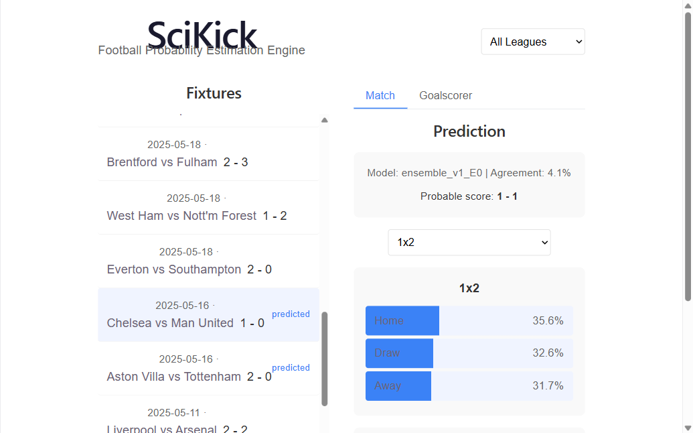
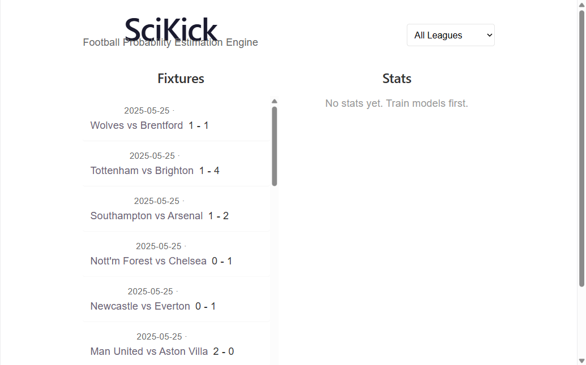
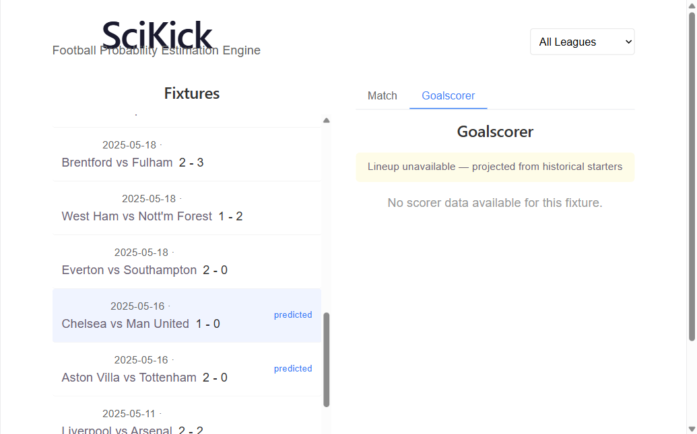

# SciKick

**Calibrated football probability estimation using classical ML** — LightGBM ensembles + Dixon-Coles.

SciKick is an **analytical instrument**, not a betting tool. It turns match history into honest, well-calibrated probability estimates across ~70 markets, with full calibration reporting so you can trust (and audit) every number it produces.


## Screenshots

Fixtures feed with league filter and a live prediction panel:



Match list with per-fixture probability view:



Goalscorer view (player-level anytime scorer probabilities):



## Why it exists

Most football "probability" tools are opaque black boxes. SciKick is the opposite: every estimate comes from a reproducible pipeline — Elo ratings, team form, xG enrichment, and a Dixon-Coles score matrix — and is **calibrated and reported** so the probabilities mean what they claim. Built for data people who want to *understand* a model, not just stare at it.

## Stack

- **Backend**: Python 3.13, FastAPI, SQLite (WAL mode), APScheduler
- **ML**: LightGBM (5-seed ensemble), Dixon-Coles (own implementation via `scipy.optimize`), Logistic Regression baseline
- **Calibration**: Isotonic regression (default), Platt scaling (< 500 samples)
- **Frontend**: React + TypeScript + Vite + Recharts
- **CPU-only**: runs fine on a quiet laptop (no GPU required)

## Features

- **~70 markets** across 3 statistical motors plus a player-level scorer module:
  - **Motor 1** — Dixon-Coles score matrix: 1x2, double chance, over/under, BTTS, asian/general handicap, exact score, goal bands, odd/even, clean sheet, win to nil, draw no bet
  - **Motor 2** — half-time + count models: HT/FT, HT 1x2, HT over/under, corners & cards over/under, combined markets
  - **Motor 4** — rare events: penalty, own goal (league-average constants)
  - **Goalscorer** — player-level anytime scorer: xG90 from Understat + position shrink + minutes estimate; lineups from API-Football (optional, improves accuracy)
- **Calibrated probabilities**: Brier score + reliability reporting; auto-recalibrates via isotonic regression (Platt below 500 samples)
- **Two retrain levels**: `light` (weekly, tuned params) and `complete` (monthly or on degradation: full Optuna tuning + blend-weight recalibration; auto-triggered when Brier degrades >15%)
- **Standalone scheduler**: daily sync + model jobs via APScheduler, no dev magic

## Quick start

```bash
# 1. Environment (Windows path shown; macOS/Linux use .venv/bin/activate)
python -m venv .venv
.venv\Scripts\activate

# 2. Dependencies
pip install -r requirements.txt
cp .env.example .env          # set SERVICE_TOKEN at minimum

# 3. Sync data (football-data.co.uk CSVs)
python -m app.cli sync --league E0 --seasons 3

# 4. Train the ensemble (takes a few minutes)
python -m app.cli train --league E0 --mode complete

# 5. Run the API
uvicorn app.api.main:app --reload
```

Frontend:

```bash
cd frontend
npm ci
npm run dev      # http://localhost:5173
```

## Project structure

```
app/
  config.py       — Settings via pydantic-settings (reads .env, singleton)
  db/             — SQLite connection, migrations, backup
  ingestion/      — Data adapters (football-data.co.uk, Understat, API-Football)
  features/       — Feature engineering (Elo, form, xG, match_features table)
  models/         — LightGBM, Dixon-Coles, blend, calibration, runs/
  api/            — FastAPI endpoints (predict, fixtures, stats, refresh)
  players/        — Goalscorer module (ingest, model, lineups, prediction)
  phase2/         — HT/FT residual multiplier (Fase 2)
  scheduler.py    — APScheduler jobs (sync, retrain, lineups)
frontend/
  src/            — React + TypeScript dashboard (fixtures, match, goalscorer)
migrations/       — numbered SQL files applied via PRAGMA user_version
```

**Core tables** (SQLite): `leagues`, `teams`, `team_aliases`, `fixtures`, `tracked` +
`match_features` (regenerable) and player tables (`players`, `player_features`, `lineups`).

## Development

```bash
# Backend tests (pytest auto-sets ENV=test, DATABASE_PATH=:memory:)
python -m pytest
python -m pytest tests/unit/          # unit only
python -m pytest -m "not slow"        # skip slow tests

# Frontend
cd frontend
npm run lint
npm test
npm run build
```

CI runs the backend suite and the frontend lint/test/build on every push and pull request (`.github/workflows/ci.yml`).

## Known limitations

- **Transfer windows**: the model does not capture mid-season roster changes.
- **LigaPro Ecuador** (Tier 4): limited feature set (no historical odds, no xG).
- **Rare events**: per-team penalty/own-goal data is not available from the source, so league-average constants are used.
- **In-play markets** (Motor 3): excluded — requires real-time event simulation and timestamped event data.
- **Goalscorer**: players need ≥450 min in Understat; confirmed lineups need an API-Football key (free tier, 100 req/day shared budget).

## License

[MIT](LICENSE) © 2026 Pablo Domínguez Aguilera
