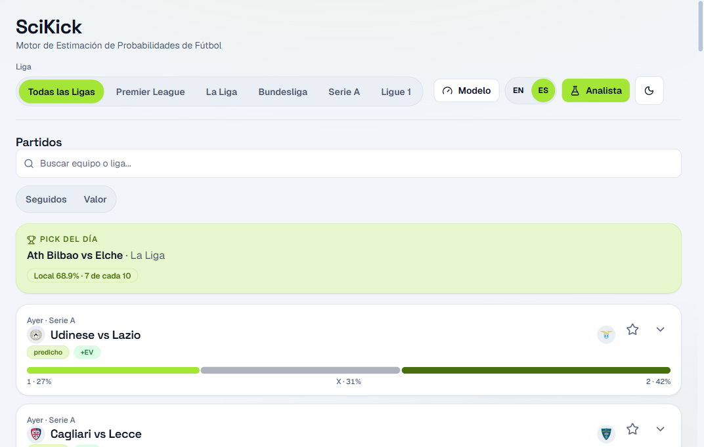
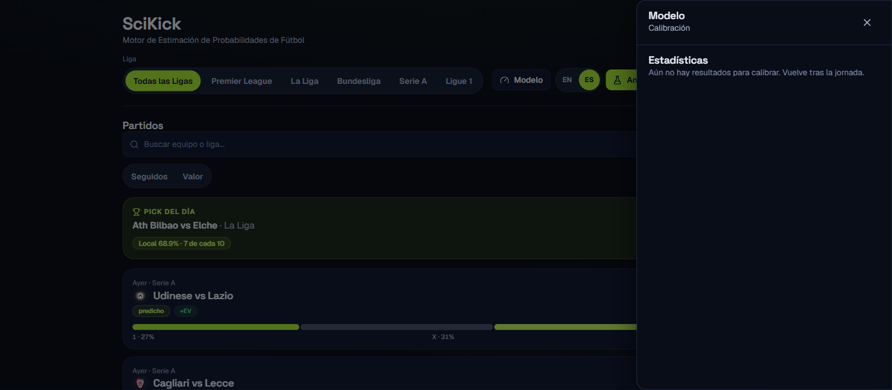

# SciKick

**Upcoming football matches with honest, team-specific probabilities** — a per-team Dixon-Coles model blended with a LightGBM ensemble, served with bookmaker odds comparison and an anytime-goalscorer view.

SciKick is an **analytical instrument, not a betting tool**. It answers "who wins this weekend, and is the bookmaker price fair?" in plain fan language, with analyst detail one toggle away.


## What it does

- **Every upcoming match, 5 leagues**: Premier League, La Liga, Bundesliga, Serie A, Ligue 1 — from today through end of season, nearest first, paginated 20 at a time.
- **One story per match**: each fixture is a card that expands inline — verdict first ("Liverpool win 5 in 10" with a 10-dot visual), then the evidence. One expanded at a time, so the page never sprawls.
- **Verdicts in plain language**: human dates ("Today", "12 Sep"), frequency framing ("6 in 10"), no codes unless analyst mode is on.
- **Team-specific probabilities**: per-team Dixon-Coles strengths (not league averages) with shrinkage for promoted teams with no history; a 3-segment 1X2 bar summarizes every card at a glance.
- **Value check**: stored bookmaker odds auto-flag +EV cards (top predicted) — or paste your own odds for expected value and quarter-Kelly stake per outcome.
- **Follow your teams**: star any club, filter to Followed only. Persisted locally, no account.
- **Goalscorer in-story**: anytime probabilities from Understat xG90 with a minutes-projected XI when lineups are unconfirmed (labeled as such).
- **Match center**: real form (last 5), head-to-head record, and momentum from played matches.
- **Model drawer**: calibration, Brier by matchday and accuracy tables live outside the story flow.
- **Shareable stories**: `?partido=<id>` deep-links auto-expand any match, no router needed.
- **Crests**: club badges from football-data.org with initial avatars as fallback.

## How it works

```
football-data.org ──▶ future fixtures ──┐
football-data.co.uk ─▶ history (CSVs) ──┤──▶ sync ──▶ features ──▶ models ──▶ API ──▶ UI
Understat ──────────▶ player xG ────────┤         Elo, form,   per-team DC +
The Odds API ───────▶ bookmaker odds ───┘         xG           LightGBM blend
```

- **Ingestion** (`app/ingestion/`): football-data.org (scheduled fixtures + team crests, primary), football-data.co.uk CSVs (history), Understat (player xG), The Odds API (1 credit/league/day, best EU price stored). API-Football code is dormant: its free tier covers seasons 2022–2024 only, so resolvers stay off behind `LINEUPS_ENABLED=false`.
- **Models** (`app/models/`): per-team Dixon-Coles strengths persisted per run (`dc_teams`), shrinkage prior (`k=8` games) for teams without history, LightGBM ensemble, isotonic calibration. Walkforward Brier (Sep 2026 retrain): E0 0.596, SP1 0.527, D1 0.470, I1 0.626, F1 0.603 — small test sets (27–37 matches), judge trends over cycles.
- **Scorer** (`app/players/`): Understat xG90 with position shrinkage and a dynamic minutes gate that scales early season; top-11-by-minutes projected XI when unconfirmed.
- **API** (`app/api/`): FastAPI + SQLite. `GET /fixtures` (`league=all|E0|…`, upcoming first, crests included), `GET /predict/{id}`, `POST /value` (manual or stored odds), `GET /context` (form + H2H + crests), `GET /predict/scorer/{id}`, stats + calibration, `POST /refresh` and `POST /resolve` (token auth). The client composes one cached bundle per story (predict required, scorer/context/value degrade gracefully).
- **UI** (`frontend/`): React + TypeScript, EN/ES, dual light/dark theme, design-token system (Tailwind v4) with Radix primitives — real tables, single-open accordions, focus-trapped drawer, chart data tables, 44px touch targets, reduced-motion support. Runtime deps: React, Recharts, Radix, lucide-react. `VITE_API_URL` points at any backend.

## The interface






## Engineering highlights

- **Reproducible runs**: every train persists params, per-team strengths, metrics (`data/runs/<league>/`); the loader serves the newest by mtime; tests never pollute it (`persist_run=False`).
- **Honest failures**: adapters log quota/plan blocks, endpoints explain causes (no silent `[]`), refresh reports per-season validation; stories show skeleton → content, error → retry.
- **Tested**: 47 backend test files / 304 tests (pytest) + 120 frontend tests across 19 files (vitest) as of Sep 2026; `oxlint` + `vite build` green on every PR via split CI workflows.
- **CPU-only, free-tier**: SQLite, no GPU, all data sources free. Full monthly ops in `docs/retrain.md`.

## Quality metrics

| Area | Status (Sep 2026) |
|---|---|
| Backend tests | 304 tests / 47 files, pytest, CI green |
| Frontend tests | 120 tests / 19 files, vitest, CI green |
| Lint / build | `oxlint` clean, `vite build` OK |
| Model Brier | E0 0.596 · SP1 0.527 · D1 0.470 · I1 0.626 · F1 0.603 (see `docs/retrain.md`) |

## Quick start

```powershell
# 1. Environment
python -m venv .venv
.\.venv\Scripts\Activate.ps1

# 2. Dependencies
.\.venv\Scripts\python.exe -m pip install -r requirements.txt
Copy-Item .env.example .env   # then fill in the keys below
```

Keys (all free tiers, no card): `FOOTBALL_DATA_ORG_KEY` (future fixtures, required), `ODDS_API_KEY` (bookmaker odds, optional — manual paste works without it), `API_FOOTBALL_KEY` (dormant unless Pro), `SERVICE_TOKEN` (for `/refresh` and `/resolve`).

```powershell
# 3. Sync data (all leagues, history + upcoming; also backfills team crests)
.\.venv\Scripts\python.exe -m app.cli sync --league E0,SP1,D1,I1,F1 --seasons 3

# 4. Train one league (~10 min on CPU, repeat per league)
.\.venv\Scripts\python.exe -m app.cli train --league E0

# 5. Predict upcoming fixtures
.\.venv\Scripts\python.exe -m app.cli predict --league E0

# 6. Run the API (syncs automatically on startup, in background)
.\.venv\Scripts\python.exe -m uvicorn app.api.main:app --port 8000
```

Frontend:

```powershell
cd frontend
npm ci
npm run dev      # http://localhost:5173 (VITE_API_URL override in frontend/.env)
```

## Project structure

```
app/
  config.py       — Settings via pydantic-settings (reads .env, singleton)
  db/             — SQLite connection, migrations
  ingestion/      — adapters (football-data.org, football-data.co.uk, Understat,
                    API-Football, The Odds API), seasons, aliases, sync, odds_sync
  features/       — Elo, form, xG, match_features table
  models/         — Dixon-Coles (per-team + shrinkage), LightGBM, blend,
                    calibration, predict, value
  api/            — FastAPI routers (fixtures, predict, scorer, value, context,
                    stats, refresh, resolve)
  players/        — Goalscorer (ingest, model, lineups, pipeline)
  scheduler.py    — APScheduler definitions (sync, lineups; run manually)
frontend/
  src/
    api/            — endpoint clients + cached story bundle (predict/scorer/context/value)
    components/
      feed/         — story cards (MatchCard, VerdictHero, SegmentedBar, Dots10,
                      TeamAvatar), filters, model drawer
      ui/           — primitives (Button, Badge, Card, Tabs, Accordion, Table,
                      Segmented, Drawer, Skeleton, Input)
      layout/       — AppShell, league switcher
    theme/          — dual light/dark provider (persisted, no-flash preload)
    hooks/          — analyst/display/followed/detail/movement/count-up
    lib/            — cn(), ?partido= deep links
    utils/          — verdicts, markets, scorer, odds, match center
    i18n/           — EN/ES dictionaries
migrations/       — numbered SQL files applied via PRAGMA user_version (001–008)
docs/retrain.md   — monthly ops playbook (sync, train, predict, resolve, quotas)
```

**Core tables** (SQLite): `leagues`, `teams` (+`crest_url`), `team_aliases`, `fixtures` (+`api_football_id`), `fixture_odds`, `tracked` + `match_features` (regenerable) and player tables (`players`, `player_features`, `lineups`).

## Development

```powershell
# Backend (conftest sets ENV=test; override keys to simulate CI without secrets)
$env:API_FOOTBALL_KEY=""; $env:FOOTBALL_DATA_ORG_KEY=""; $env:ODDS_API_KEY=""
.\.venv\Scripts\python.exe -m pytest tests/ -m "not slow"

# Frontend
cd frontend
npm run lint
npm test
npm run build
```

Split CI (`.github/workflows/ci-backend.yml`, `ci-frontend.yml`) runs backend tests and frontend lint/test/build per pull request, filtered by paths.

## Known limitations

- **2025/26 season history**: football-data.co.uk has not published the 2526 CSVs yet; the model trains on 22/23–24/25 until they appear (the sync window picks them up automatically).
- **Lineups**: confirmed XIs need API-Football Pro; the in-story scorer section projects from minutes and says so.
- **Early season noise**: with few matchdays played, edges vs bookmakers run large; calibration needs 30+ resolved predictions (`POST /resolve` biweekly).
- **Team name display**: a few canonicals lack accents (`Espanol`, `Alaves`) — mapping artifact, fix planned.
- **Crests**: backfilled from the next sync on; until then teams show initial avatars.
- **Transfer windows**: the model does not capture mid-season roster changes.
- **In-play**: pre-match only, no live markets.

## Roadmap

- Display-name mapping for accent-less canonicals.
- Legend for odds-movement arrows.
- Team pages from the follow list, and real `/partido/:id` routes replacing `?partido=`.
- Hosted backend (frontend is Vercel-ready via `VITE_API_URL`).

## License

[MIT](LICENSE) © 2026 Pablo Domínguez Aguilera
