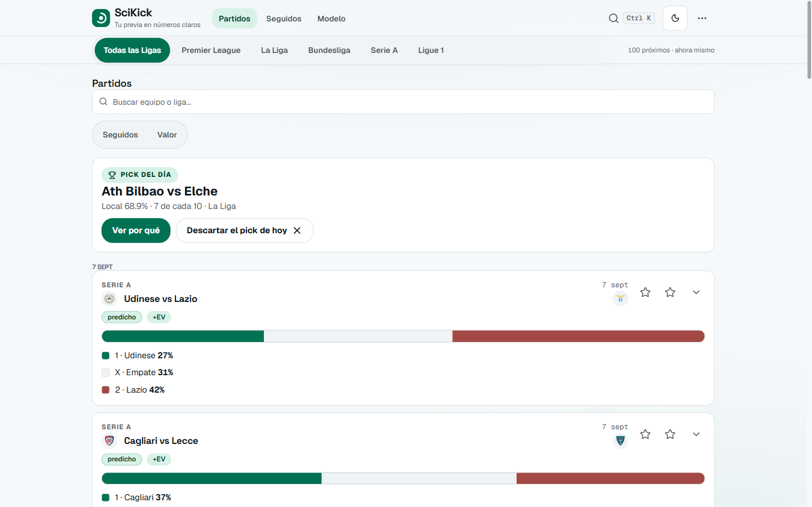
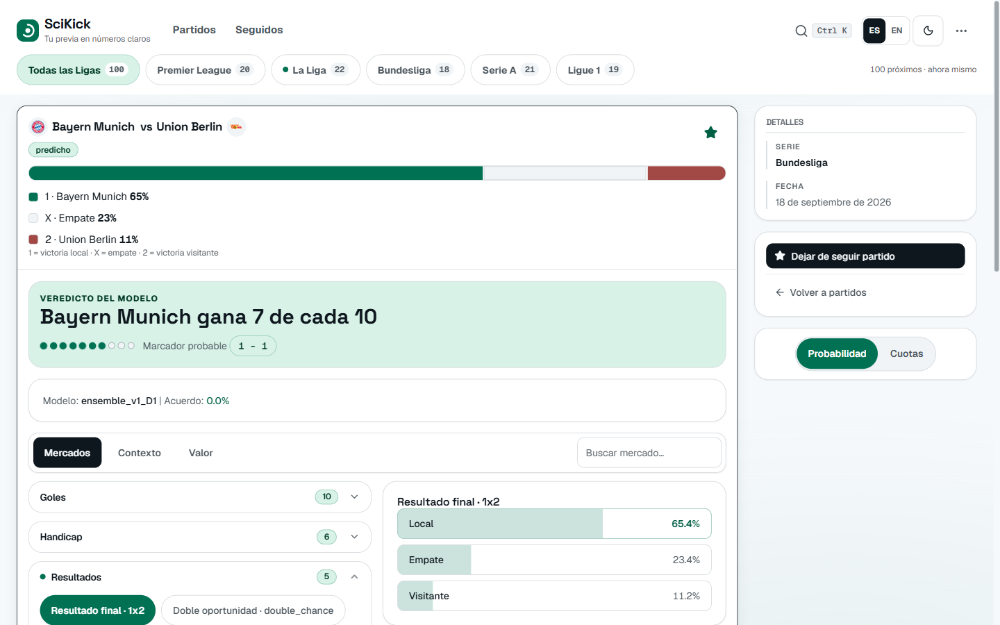
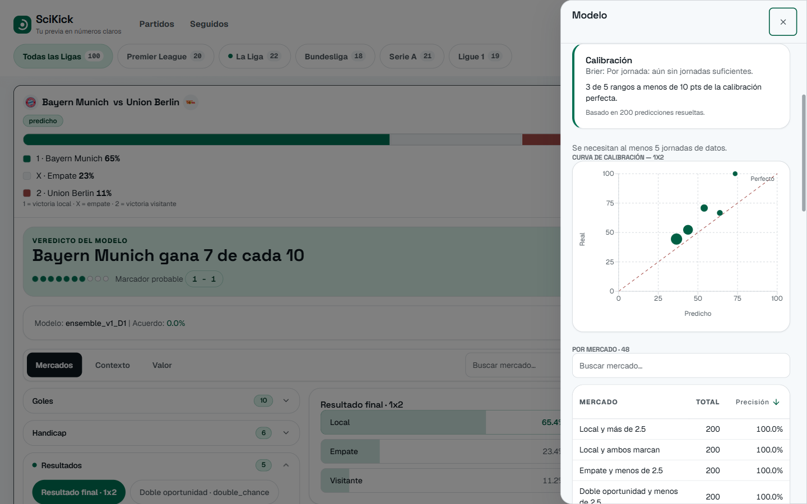

# SciKick

**Upcoming football matches with honest, team-specific probabilities** — a per-team Dixon-Coles model blended with a LightGBM ensemble, served with bookmaker odds comparison and an anytime-goalscorer view.

SciKick is an **analytical instrument, not a betting tool**. It answers "who wins this weekend, and is the bookmaker price fair?" in plain fan language, with analyst detail one toggle away.




## What it does

- **Every upcoming match, 5 leagues** (Premier, La Liga, Bundesliga, Serie A, Ligue 1) — from today on, nearest first, 12 per page, with a toggle for past dates.
- **One story per match**: verdict first ("Arsenal wins 7 in 10"), then the evidence across Mercados / Contexto / Valor tabs. Verdict, charts and context stay in plain language; the probable scoreline only appears when it agrees with the verdict.
- **Full-market explorer**: accordions open on the active market, the chart updates live side by side; half-time scenarios one at a time.
- **Value check that names its source** ("best European odds", possibly split across shops) with plain-words stakes; edges above +100% are treated as bad data. Model combo labeled as a rough guide.
- **Followed page, scorer search, shareable `/partido/:id` routes**, ES/EN switch, light/dark pine theme.

## The model

- **Per-team Dixon-Coles** (`app/models/`): attack/defence strengths per club with a shrinkage prior (`k=8` games) for promoted teams; **LightGBM ensemble + isotonic calibration**. Walk-forward Brier (Sep 2026):

| E0 | SP1 | D1 | I1 | F1 |
|---|---|---|---|---|
| 0.596 | 0.527 | 0.470 | 0.626 | 0.603 |

Small test sets (27–37 matches) — judge trends over cycles, see `docs/retrain.md`. Scorer: Understat xG90 with position shrinkage and a minutes gate that scales early season.

## How it works

```
football-data.org ──▶ fixtures ──┐
football-data.co.uk ─▶ history ───┤──▶ sync ──▶ features ──▶ models ──▶ API ──▶ UI
Understat ──────────▶ player xG ──┤         Elo + form + xG ──▶ per-team DC + LightGBM
The Odds API ───────▶ odds ───────┘         (1 credit/league/day, best EU price stored)
```

FastAPI + SQLite (`GET /fixtures` with `upcoming` filter, `/predict/{id}`, `POST /value` with source, `/context`, `/predict/scorer/{id}`, stats, token-authed `/refresh` + `/resolve`). React + TypeScript UI (Radix, Recharts, WCAG-AA audited palette). `VITE_API_URL` points at any backend.

## The interface






## Health

- **Tested**: 309 backend tests / 47 files (pytest) + 213 frontend tests / 28 files (vitest); `oxlint` + `vite build` green on every PR via split CI.
- **Reproducible**: every train persists params, strengths and metrics (`data/runs/<league>/`); monthly ops in `docs/retrain.md`. CPU-only, free-tier sources.

## Quick start

```powershell
python -m venv .venv; .\.venv\Scripts\Activate.ps1
.\.venv\Scripts\python.exe -m pip install -r requirements.txt
Copy-Item .env.example .env   # fill in: FOOTBALL_DATA_ORG_KEY (required), ODDS_API_KEY (optional), SERVICE_TOKEN (/refresh + /resolve)
.\.venv\Scripts\python.exe -m app.cli sync --league E0,SP1,D1,I1,F1 --seasons 3
.\.venv\Scripts\python.exe -m app.cli train --league E0   # ~10 min CPU, repeat per league
.\.venv\Scripts\python.exe -m app.cli predict --league E0
.\.venv\Scripts\python.exe -m uvicorn app.api.main:app --port 8000
cd frontend; npm ci; npm run dev      # http://localhost:5173
```

## Project structure

```
app/          — config, db + migrations, ingestion, features, models, api, players
frontend/src/ — api clients, feed/match components, ui primitives, i18n EN/ES
migrations/   — numbered SQL (001–008) via PRAGMA user_version
docs/         — retrain.md (monthly ops), screenshots/
```

## Development

```powershell
.\.venv\Scripts\python.exe -m pytest tests/ -m "not slow"  # ENV=test via conftest
cd frontend; npm run lint; npm test; npm run build
```

## Known limitations

- **2025/26 history**: 2526 CSVs unpublished (empty placeholders in `data/raw/`); trains on 22/23–24/25 meanwhile.
- **No confirmed lineups** (needs API-Football Pro) — scorer projects from minutes and says so; no transfers, no in-play.
- **Early-season noise**: edges above +100% treated as bad data; calibration needs 30+ resolved predictions.
- **Stored odds are best-per-outcome**, possibly split across shops — a +EV set may not be buyable in one place.
- **Display data**: some canonicals lack accents (`Espanol`); crests backfill from the next sync.

## Roadmap

- Display-name mapping for accent-less canonicals.
- Hosted backend (frontend is Vercel-ready via `VITE_API_URL`).
- Quieter value prefetch (stop 404-chasing fixtures without stored odds).
- +EV micro-glossary for first-time users.
- Weekly review loop for atypical stored odds.

## License

[MIT](LICENSE) © 2026 Pablo Domínguez Aguilera
